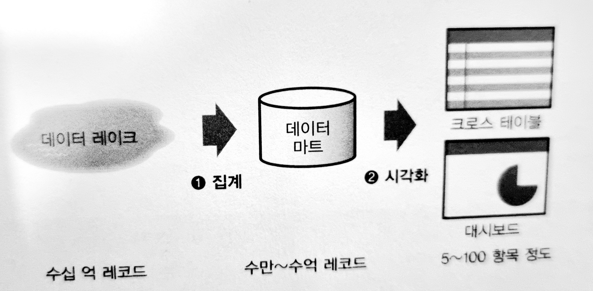
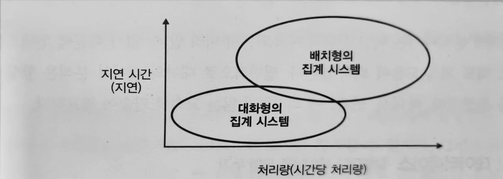
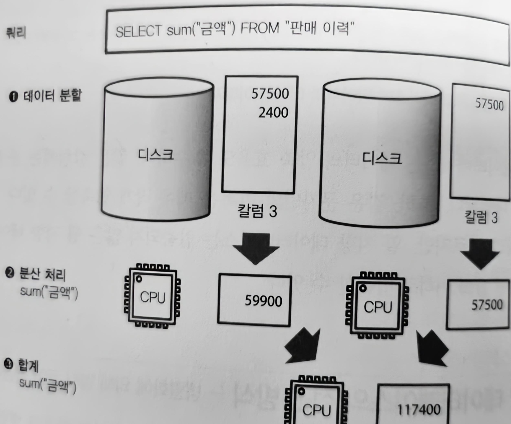
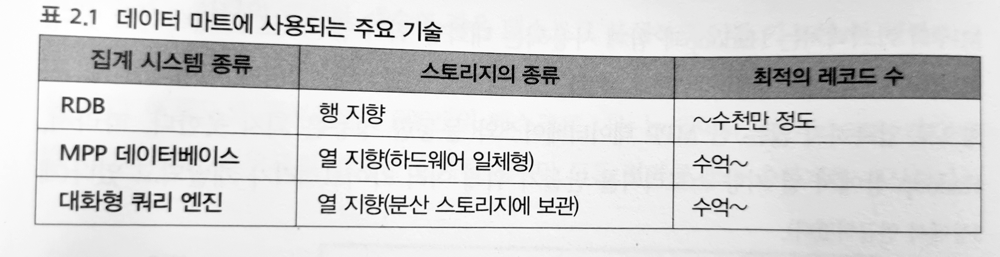
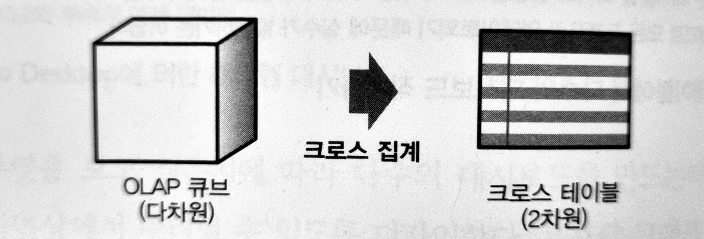
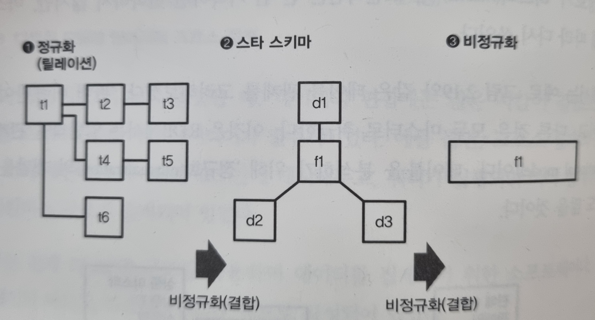

# 빅데이터의 탐색
## 크로스 집계의 기본
### 트랜잭션 테이블, 크로스 테이블, 피벗 테이블 : 크로스 집계의 개념
* 크로스 테이블 : 행과 열이 교차하는 부분에 숫자 데이터가 들어감 (DB에서는 행을 추가하는 것은 간단하지만 열을 늘리는것은 간단하지 않기 때문에 사용하기 어려움)
* 트랜잭션 테이블 : 행 방향으로만 증가하게 하고, 열 방향으로는 데이터를 증가시키지 않게함
* 크로스 집계 : 트랜잭션 -> 크로스로 변환하는 과정
* 피벗 테이블 : 표에 저장된 총 또는 평균 데이터를 요약, 정렬, 재구성, 그룹, 카운트, 정리하는 데 사용( 소량의 데이터를 크로스 집계하는데 편리함 )

### 룩업 테이블 : 테이블을 결합하여 속성 늘리기
* 트랜잭션 테이블에 새로운 항목을 추가하는 것이 아닌 다른 테이블과 결합할때 사용

### SQL에 의한 테이블의 집계 : 대량 데이터의 크로스 집계 사전 준비
* 피벗 테이블에 의한 크로스 집계는 간편하지만, 대용량 데이터는 처리할 수 없음
* BI 도구와 pandas라면 수백만 레코드는 집계할 수 있지만, 그 이상이 되면 너무 느려져서 쓸 수 없음
* 대량의 데이터를 크로스 집계하려면 SQL을 사용하여 데이터 집계(aggregation), 즉 SUM()과 같은 집계합수(aggregate functions)를 이용하여 데이터양 감소를 고려
* 데이터를 먼저 SQL로 집계하고 시각화 도구로 크로스 집계하는 두 단계의 절차( 전자는 데이터 집계의 프로세스, 후자는 시각화 프로세스)

## 데이터 집계 -> 데이터 마트 -> 시각화 : 시스템 구성은 데이터 마트의 크기에 따라 결정된다
* 데이터 마트가 작을수록 시각화 하는 것이 간단하지만, 동시에 원래 데이터에 포함된 정보를 잃어버리게 되어 시각화의 프로세스에서 할 수 있는것이 적어짐
* 반대로 데이터 마트가 클수록 좋은 시각화를 할 수 없게 됨

### 열 지향 스토리지에 의한 고속화
* 메모리에 다 올라가지 않을 정도의 대량의 데이터를 신속하게 집계하려면 미리 데이터를 집계에 적합한 형태롤 변환하는 것이 필요

### 데이터 베이스의 지연을 줄이기

#### 데이터 처리의 지연 : 지연이 적은 데이터 마트 작성을 위한 기초 지식
* 모든 데이터를 메모리에 올리는것 ( 수십GB의 메모리까지 어렵지 않음)
* 압축과 분산에 의해 지연 줄이기 MPP 기술 ( 데이터를 가능한 작게 압축하고 그것을 여러 디스크에 분산함으로써 데이터의 로드에 따른 지연을 줄임)

### 열 지향 데이터베이스 접근 : 컬럼을 압축하여 디스크 I/O 줄이기
* 빅데이터로 취급되는 데이터 대부분은 디스크 상에 있기 때문에 쿼리에 필요한 최소한의 데이터만을 가져옴으로써 지연이 줄어듬
* 컬럼 단위로의 압축, 컬럼 지향 데이터베이스(열 지향 데이터 베이스)

#### 처리량과 지연시간 (항상 양립하지는 않음)
* 일정 시간에 처리할 수 있는 데이터의 양, 배치 처리등의 대규모 데이터 처리
* 데이터 처리가 끝날 때까지의 대기 시간, 애드 혹 데이터 분석
* 데이터 웨어하우스, 데이터 레이크는 대량의 데이터를 처리하기 위해 주로 처리량을 중시
* 데이터 마트는 지연시간의 단축, 충분한 메모리를 준비하거나 디스크 I/O 절감이 필수

#### 행 지향 데이터 베이 : 각 행이 디스크 상에 일련의 데이터로 기록
* 테이블의 각 행을 하나의 덩어리로 디스크에 저장, 새 레코드를 추가할 때 파일의 끝에 데이터를 쓸 뿐이므로 빠르게 추가 가능
* 매일 발생하는 대량의 트랜잭션을 지연 없이 처리하기 위해 데이터 추가를 효율적으로 할 수 있음
* 데이터 검색을 고속화하기 위해서 인덱스를 사용함

#### 열 지향 데이터 베이스 : 컬럼마다 데이터를 모아두기
* 데이터를 미리 컬럼 단위로정리해 둠으로써 필요한 컬럼만을 로드하여 디스크 I/O를 줄임
* 같은 컬럼에는 종종 유사한 데이터가 나열, 특히 같은 문자열의 반복은 매우 작게 압축 가능
* 데이터의 종류에 따라 다르지만 보통 행 지향에 비해서 1/10 이하로 압축 가능

### MPP 데이터 베이스의 접근 방식 : 병렬화에 의해 멀티 코어 활용하기

* MPP 데이터베이스에서는 여러 디스크에 분산된 데이터가 서로 다른 CPU 코어에 의해 읽혀 부분적인 쿼리 실행이 이루어짐
* 결과들은 한 곳에 모이고 최종적인 결과가 도출되는데, 이러한 일련의 처리는 가능한 한 동시에 병렬로 실행

#### MPP 데이터베이스와 대화형 쿼리 엔진
* 쿼리가 잘 병렬화 할 수 있다면, MPP를 사용한 데이터의 집계는 CPU 코어 수에 비례하여 고속화
* 단, 디스크로부터의 로드가 병목 현상이 발생하지 않도록 데이터가 고르게 분산

### 애드 혹 분석과 시각화 도구
#### Jupyter Notebook에 의한 애드 혹 분석
* 어떤 분석이라도 처음에는 애드 혹 분석부터 시작, 시행착오를 반복하며 데이터를 살펴보는 것
#### 정기적으로 집계결과를 시각화하는 대시보드
* Redash : SQL에 의한 쿼리의 실행결과를 그대로 시각화, 하나의 쿼리가 하나 또는 여러개의 그래프에 대응되며 데이터 마트가 불필요함 
* Superset : 화면상에 마우스 조작만으로 시각화, 내장 스토리지 시스템을 가지고 않기 때문에 외부 데이터 저장소에 의존
* Kibana : Elasticsearch의 프론트엔드에서 실시간으로 작성, 오직 Elasticsearch의 DB만 바라봄, 검색 조건에 맞는 데이터를 빠르게 시각화하는데에 적합함

#### 대화적인 대시보드인 BI 도구
* 시각화에 적합한 데이터 마트를 만들어 읽고,쓰는것을 전제로 함
#### 하나의 데이터를 다각적으로 분석하기
* 배치 처리에 의한 데이터 마트를 작성이 필요하며, 데이터 마트에 테이블을 만들고 거기에서 파생된 다수의 대시보드가 BI 도구의 시각화 과정  

### 데이터 마트의 기본 구조
#### 시각화에 적합한 데이터 만들기 ( OLAP : On Line Analytical Process )
* 다차원 모델과 OLAP 큐브
  * 데이터 분석을 위해 만들어진 다차원 테이블을 OLAP 큐브라고하며 , 그것을 크로스 집계하여 크로스 테이블(2차원)로 만드는 것이 OLAP
  

##### MPP 데이터베이스와 비정규화 테이블
* BI 도구와 MPP 데이터베이스를 조합하여 크로스 집계하는 경우가 많아짐
* 이미 존재하는 테이블을 그대로 시각화 하려는 것이 아닌, 만들고 싶은 그래프에 따라 다차원 모델을 설계
* MPP에는 다차원 개념이 없기 때문에 대신해서 비정규화 테이블을 사용

#### 테이블을 비정규화하기
##### 데이터베이스 설계에서는 데이터를 종종 마스터와 트랜잭션으로 구분
* 트랜잭션 데이터 : 시간과 함께 생성되는 데이터를 기록, 변하지 않음
* 마스터 데이터 : 트랜잭션에 참고되는 각종 정보 기록, 상황에 따라 다시 쓰임

##### 팩트 테이블과 디멘션 테이블
* 팩트 테이블 : 데이터 웨어하우스에서는 트랜잭션과 같은 데이터를 팩트 테이블이라 부름
* 디멘션 테이블 : 참고되는 마스터 데이터

##### 스타 스키마와 비정규화
* 스타 스키마 : 팩트 테이블을 중심으로 여러 디멘션 데이블이 결합

* 데이터 양이 커짐으로써 팩트 테이블은 디멘션 테이블보다 훨씬 커져 그 데이터 양이 집계 시간을 좌우함
* 팩트 테이블이 메모리 용량을 초과한 시점부터 디스크 I/O가 발생하고 그 대기시간이 지연으로 이어짐
* 팩트 테이블은 작게 놔두는것이 고속화에 중요하고, 팩트 테이블에는 ID와 KEY 값만 남기고 나머지는 디멘션으로 옮겨야됨

#### 비정규화 테이블 : 데이터 마트에는 정규화가 필요없다
* MPP 데이터베이스와 같은 열지향 스토리지를 갖는 시스템이 보급됨에 따라 위와 같은 일은 줄어들었음
* 열지향 스토리지는 칼럼 단위로 데이터가 저장되어, 칼럼이 아무리 늘어나도 성능에 영향을 주지 않음
* 열지향 스토리지는 칼럼 단위로의 압축이 있어 문자열이라고 해도 아주 작게 압축됨, 디스크 I/O이 줄어들음
* 스타 스키마에서 더욱 비정규화하여 팩트 테이블에 연결한것을 비정규화 테이블이라고함
